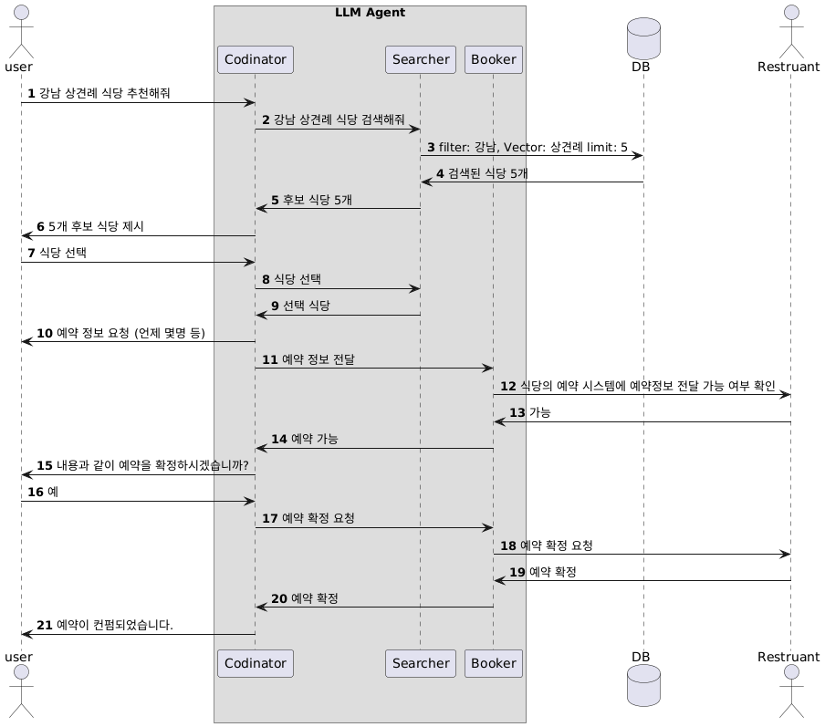

# Book Restaurant Agent

This project is a hands-on assignment to design and develop a Multi-Agent System (MAS) that provides restaurant search, recommendation, and reservation services. You will use the [Google ADK(Agent Development Kit)](https://google.github.io/adk-docs) to build agent services and complete the assignment.

## System Architecture

The system consists of three main components:
- **Client**: Provides the user interface.
- **Server**: Acts as a bridge between the client app and the agent.
- **Agent**: Uses LLMs to handle restaurant search, recommendation, and reservation requests.

### Architecture Diagram

```mermaid
graph LR
    A[Client] -- HTTP --> B[Server]
    B -- HTTP --> C[Agent]
```

### Client

- The client app is developed with Flutter.
- To install packages and run the client app:
	```sh
	flutter pub get
	flutter run -d windows
	```

### Server

- The server is built with Python using FastAPI.
- To install packages and run the server:
	```sh
	pip install fastapi uvicorn
	uvicorn server:app --host 0.0.0.0 --port 5000
	```
- The server runs on `localhost:5000`.

### Agent

- The agent is developed using [Google ADK](https://google.github.io/adk-docs).
- A simple agent is provided as a starting point. You are required to develop and improve the agent to complete the assignment.
- To install packages and the agent:
	```sh
    pip install google-adk
	adk web
	```
	or
	```sh
    pip install google-adk
	adk api_server
	```
- The agent runs on `localhost:8000`.

## Assignment Goals

- Understand the architecture of a multi-agent system.
- Implement and extend the agent to handle user requests for restaurant search, recommendation, and reservation.
- Integrate the client, server, and agent components for a complete workflow.

## Additional Resources

- Sample restaurant data is provided in the `yelp/restaurants.json` file.

## Sequence Diagram
